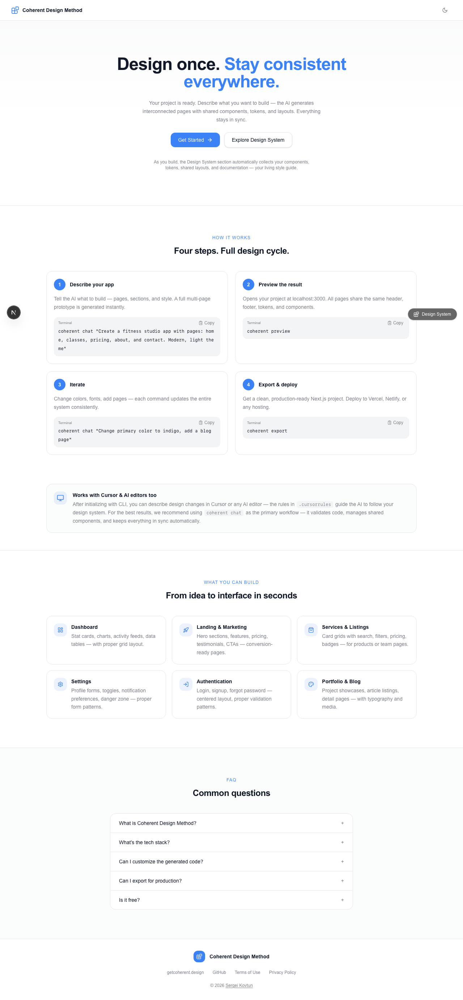
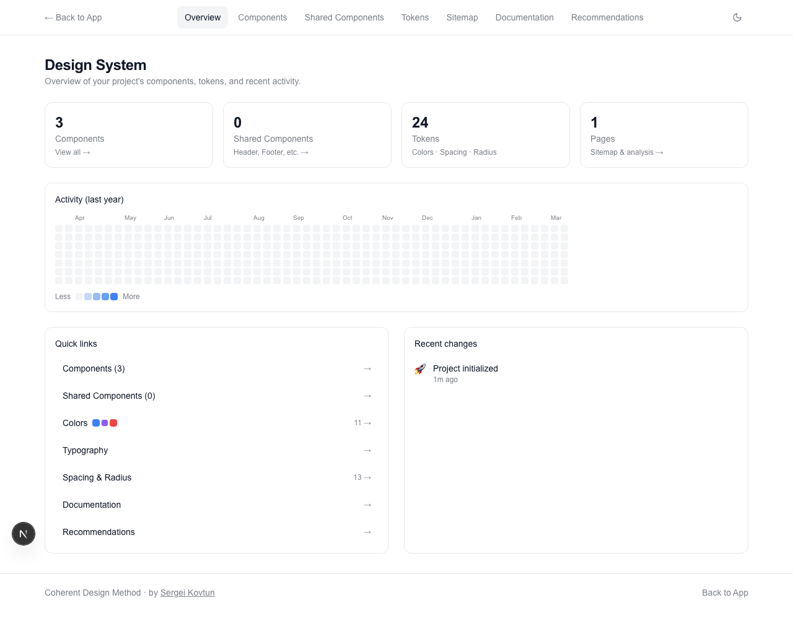

# Building a Project Management SaaS with Coherent Design Method

> From zero to a fully functional, multi-page Next.js prototype in minutes — using only natural language prompts.

## What We'll Build

**Projector** — a project management SaaS with dashboards, task tables, team management, analytics, and authentication pages. The entire UI is generated through a series of 4 conversational prompts, demonstrating how Coherent Design Method maintains design consistency across an evolving application.

**Tech stack:** Next.js 15, Tailwind CSS, shadcn/ui components, TypeScript.

---

## Step 0: Initialize the Project

```bash
mkdir ~/test-projector && cd ~/test-projector
npx @getcoherent/cli@0.2.3 init
```

This creates a Next.js 15 app with:
- Tailwind CSS and shadcn/ui pre-configured
- A design system configuration file (`design-system.config.ts`)
- A built-in Design System viewer at `/design-system`
- AI context files (`.cursorrules`, `CLAUDE.md`) for editor integration

**What you see after init:**

The default landing page is a template explaining the Coherent Design Method. The Design System viewer already tracks 3 components, 24 tokens, and 13 spacing/radius values — all from the base configuration.





**Cost:** $0 (no AI calls)
**Time:** ~30 seconds

---

## Step 1: Create the Core Pages

Our first prompt asks for a landing page and a dashboard — the two most important pages for any SaaS.

```bash
npx coherent chat "Build a project management SaaS called Projector. Create a landing page with hero section, features grid, pricing cards, and testimonials. Also create a dashboard with project stats, recent activity feed, and task overview cards."
```

> Waiting for output...

