# From prompt to a complete UI prototype in 31 minutes

*No Figma. No CSS. No design system. Just natural language.*

Designing a SaaS interface takes days: wireframes in Figma, a design system to build, tokens to configure, components to align across pages, dark mode to test. I skipped all of that and built a complete, interactive UI prototype in 31 minutes — using only text prompts.

Not a mockup. Not a screenshot. A real Next.js app you can click through, toggle dark mode, navigate between pages, and hand to a developer as a production-ready frontend — or use directly as a high-fidelity prototype for user testing.

Here's exactly how — every command, every prompt, every result.

**What you'll need:**
- A Mac or PC (Windows/macOS/Linux)
- Node.js 20+ — [download here](https://nodejs.org) if you don't have it
- An API key — Claude (Anthropic) or ChatGPT (OpenAI) — see below
- ~30 minutes

**What you'll build:**
- Landing page with hero, features, pricing, and testimonials
- Dashboard with sidebar navigation, KPI cards, and activity feed
- Projects, Tasks, Team, and Settings pages — each with unique, appropriate layouts
- Full auth flow (Login, Register, Forgot Password, Reset Password) — auto-generated
- 10 shared components extracted and reused across pages automatically
- Consistent design tokens across light and dark mode
- Everything validated against 100+ design rules

> **Important distinction:** Coherent generates an interactive UI design — a clickable, navigable prototype backed by real components. It's not a backend, not a database, not a deployed SaaS. Think of it as what comes out of a design sprint — but in code, not Figma, and ready for a developer to wire up.

---

## Before you start: Get your API key

Coherent uses Claude (by Anthropic) or ChatGPT (by OpenAI) to generate your UI. You'll need an API key — think of it as a password that lets Coherent talk to the AI on your behalf.

**Option A — Claude (recommended):**

1. Go to [console.anthropic.com](https://console.anthropic.com) and create a free account
2. Click **API Keys** in the left sidebar → **Create Key**
3. Copy the key — it looks like `sk-ant-...`

**macOS / Linux:**
```bash
export ANTHROPIC_API_KEY=sk-ant-your-key-here
```

**Windows (Command Prompt):**
```bash
set ANTHROPIC_API_KEY=sk-ant-your-key-here
```

**Option B — ChatGPT:**

1. Go to [platform.openai.com](https://platform.openai.com) and create an account
2. Click **API Keys** → **Create new secret key**
3. Copy the key — it looks like `sk-...`

**macOS / Linux:**
```bash
export OPENAI_API_KEY=sk-your-key-here
```

**Windows (Command Prompt):**
```bash
set OPENAI_API_KEY=sk-your-key-here
```

> **How much will this cost?** Generating a full app like Projector uses roughly $0.50–$2 in API credits. New accounts on both platforms get free credits to start.

---

## How to open a terminal

- **macOS** — press `Cmd + Space`, type "Terminal", press Enter
- **Windows** — press `Win + R`, type "cmd", press Enter
- **VS Code** — press `` Ctrl + ` `` to open the built-in terminal

---

## Install Coherent

```bash
npm install -g @getcoherent/cli
```

One command. You only need to do this once.

---

## Step 1: Create the project

```bash
coherent init projector
cd projector
```

This scaffolds a Next.js 15 app with Tailwind CSS, shadcn/ui, design tokens, and a live Design System Viewer — zero configuration required.

**Cost:** $0 — no AI calls yet
**Time:** ~30 seconds

---

## Step 2: See what you're starting with

```bash
coherent preview
```

Your browser opens automatically. You'll see a default landing page and can explore the Design System Viewer at `/design-system` — it updates in real time as you build.

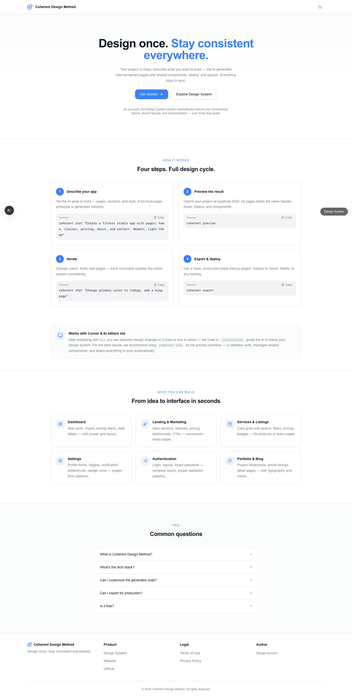

Try the theme toggle (sun/moon icon) to switch between light and dark mode. Both work out of the box — every component you generate will automatically support both.

---

## Step 3: Generate the entire app in one prompt

This is where it gets interesting. Notice: the prompt isn't just a feature list — it describes how the app should *feel*.

```bash
coherent chat "Build a project management app called Projector. The design should feel premium and focused — think Notion meets Linear. Dark sidebar navigation for app pages. Landing page: bold hero with gradient headline, 3-column feature grid with icon containers, 3-tier pricing (Starter $0, Pro $19/mo, Business $49/mo) with the middle plan highlighted, and a testimonials section. Dashboard: 4 KPI stat cards at the top, recent activity feed on the left, upcoming tasks list on the right. Projects page: card grid showing each project with a progress indicator, team member avatars, and last-updated timestamp. Tasks page: full data table with columns (Task, Status, Priority, Assignee, Due Date), filter dropdowns for status and priority. Team page: member cards with avatar, name, role badge, and email. Settings page: 3 tabs — Profile (form with avatar upload area), Notifications (toggle switches for each channel), Integrations (connected service cards with status badges)."
```

**What makes this prompt effective:**
- **"Premium and focused — think Notion meets Linear"** — this isn't decoration. Coherent's design thinking layer interprets mood descriptions and translates them into concrete choices: darker backgrounds, tighter spacing, subdued color palette, monospace accents. The AI answers five internal questions (purpose, audience, mood, focal point, rhythm) *before* writing a single line of code.
- **"Dark sidebar navigation"** — explicit layout choice. Without it, Coherent defaults to header navigation.
- **Specific data** — actual prices ($0, $19, $49), column names (Task, Status, Priority), tab names (Profile, Notifications, Integrations). The more concrete the prompt, the more realistic the output.
- **No auth pages listed** — Coherent auto-generates `/login`, `/register`, `/forgot-password`, and `/reset-password` when it detects your app has protected pages. Same for detail routes like `/projects/[id]`.

**Behind the scenes**, the terminal shows 6 pipeline phases:

```
Phase 1/6 — Planning pages...
Phase 2/6 — Generating architecture plan...
Phase 3/6 — Generating Home page (sets design direction)...
Phase 4/6 — Extracting design patterns...
Phase 4.5/6 — Generating shared components from plan...
Phase 5/6 — Generating 8 pages in parallel...
```

Phase 3 generates the landing page first and locks in the visual direction. Phase 4 extracts the style patterns — container widths, spacing rhythm, color palette, typography choices. Every subsequent page inherits this contract, so a card on the Dashboard uses the same border-radius, shadow, and spacing as a card on the Projects page.

This step takes 2–5 minutes.

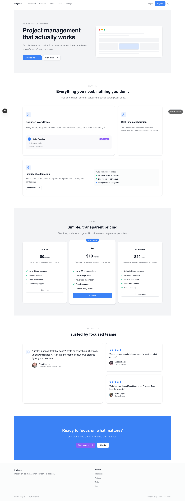

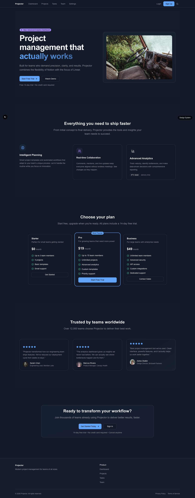

---

## Step 4: Explore the dashboard

The dashboard is the heart of any SaaS UI. Notice how the sidebar, stat cards, and activity feed share the same visual language established on the landing page — same border-radius, same font weights, same spacing scale.

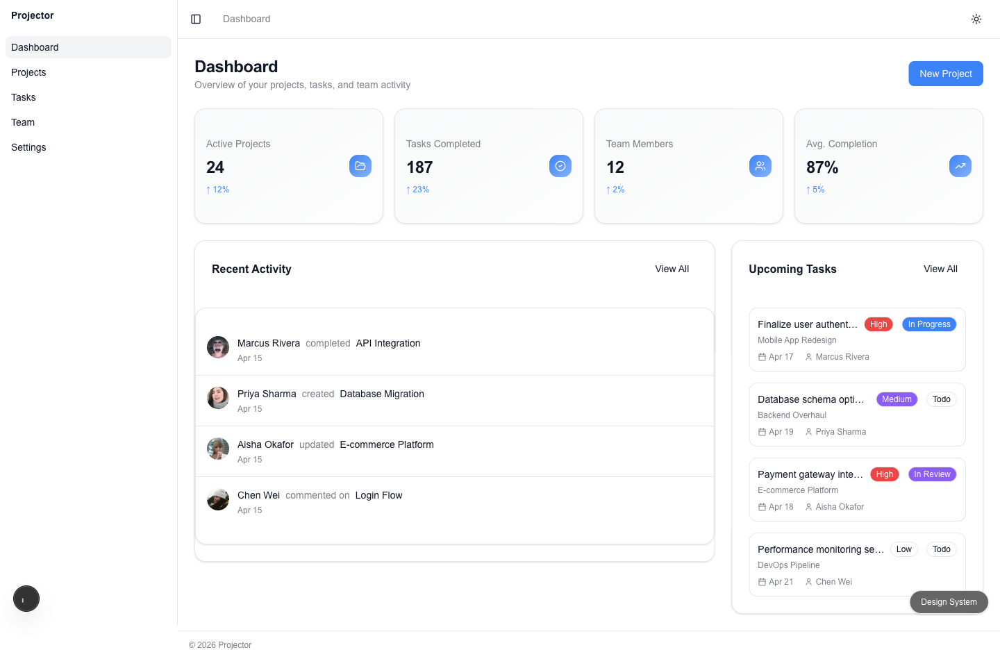

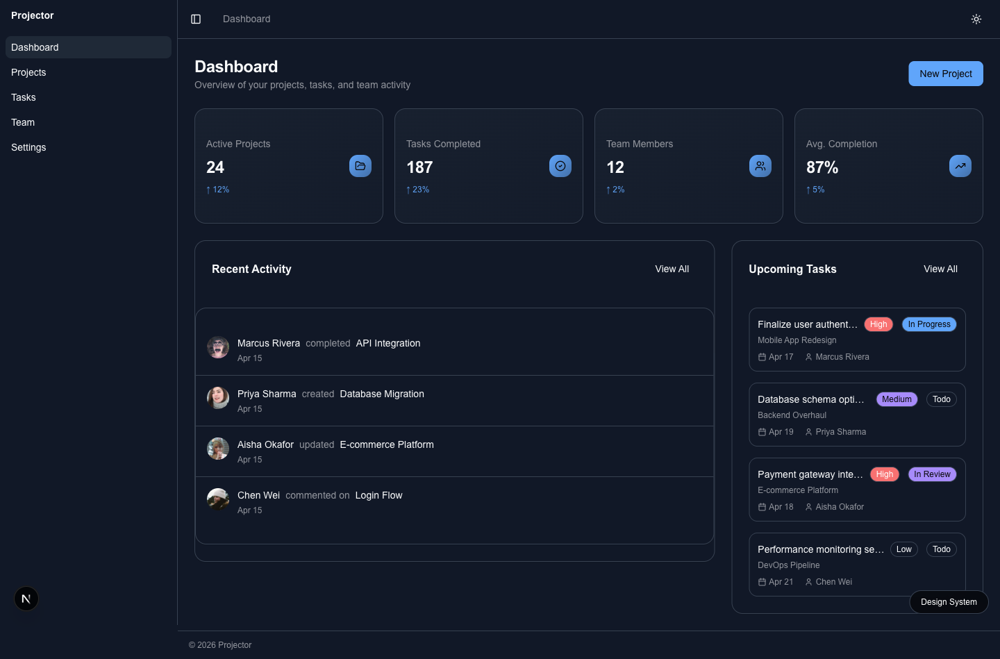

---

## Step 5: Walk through every page

```bash
coherent status
```

The output shows what was built:

```
📁 Location: ~/projector
📊 Statistics:
   Pages: 12
   Components: 18
   Design tokens: 52
```

The app organizes into three layout groups automatically:

| Layout | Pages | Navigation |
|--------|-------|-----------|
| **Public** | Landing (`/`) | Header with nav links |
| **App** | Dashboard, Projects, Tasks, Team, Settings | Sidebar |
| **Auth** | Login, Register, Forgot Password, Reset Password | Centered card, no nav |

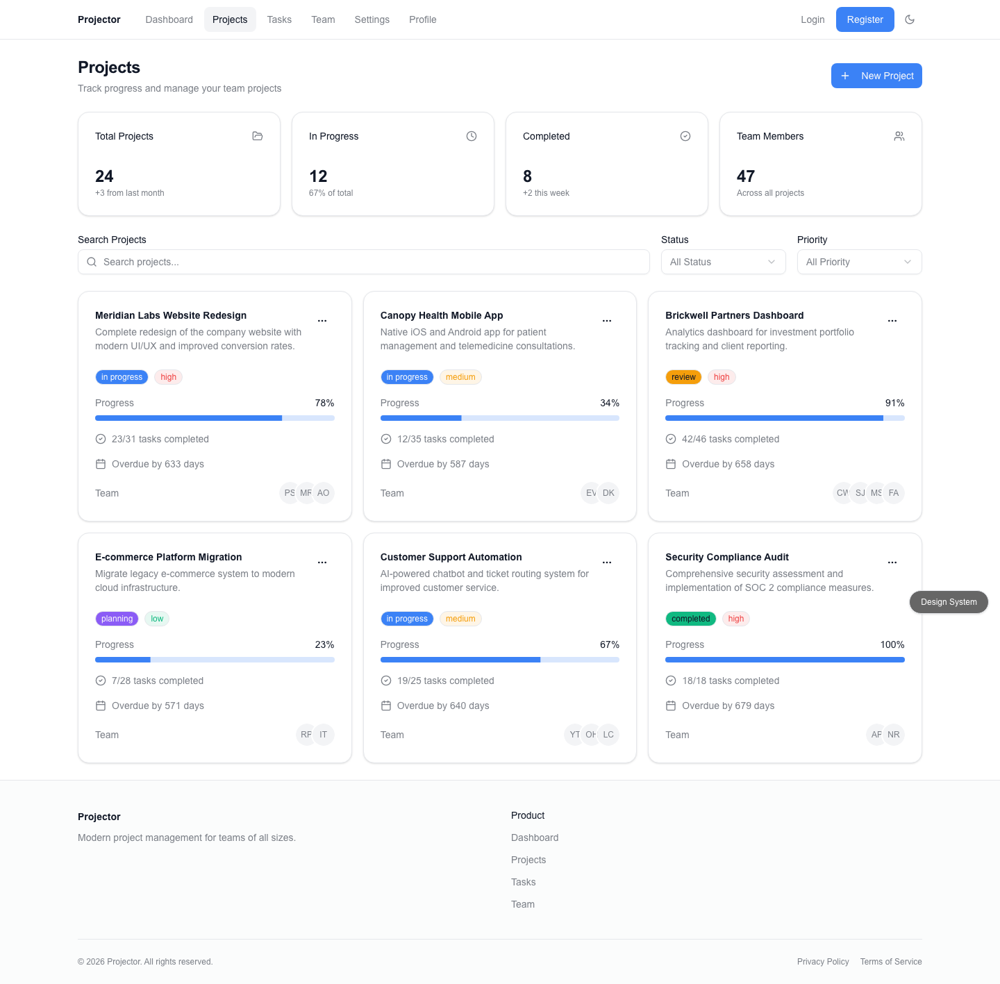

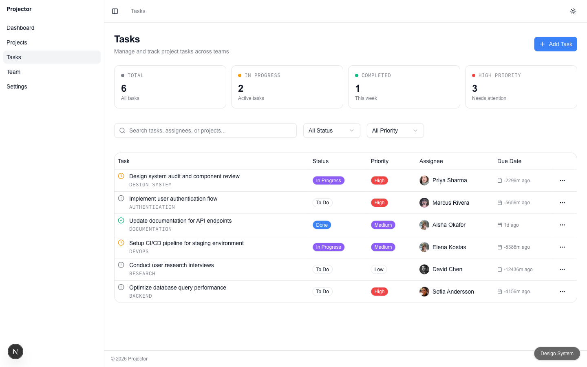

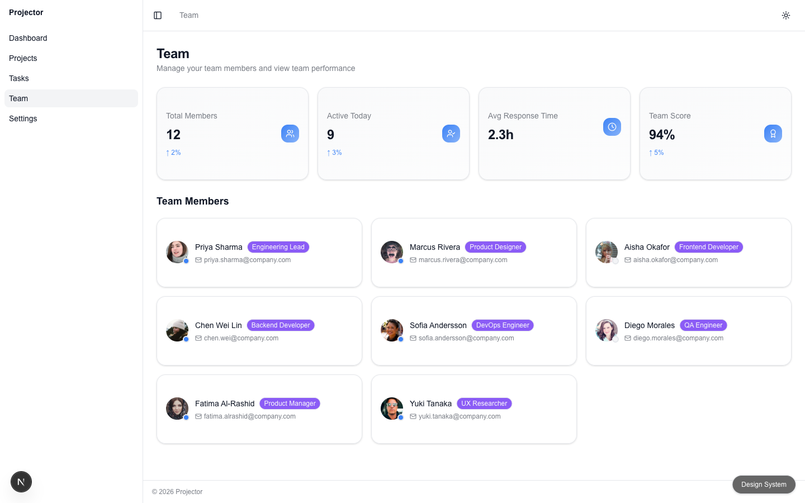

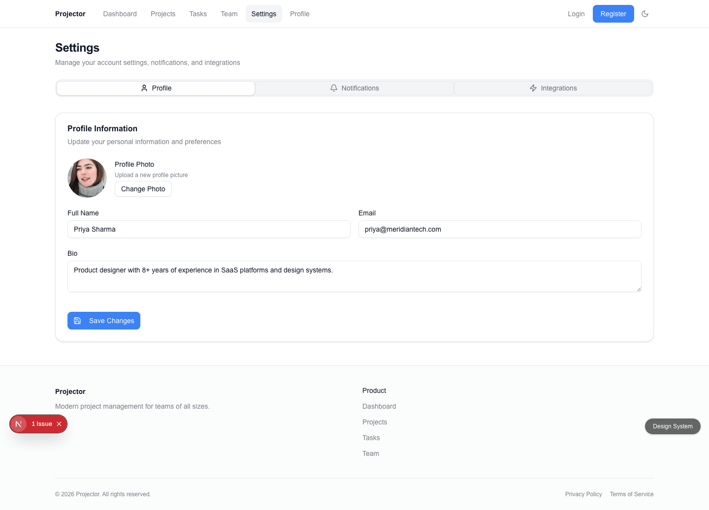

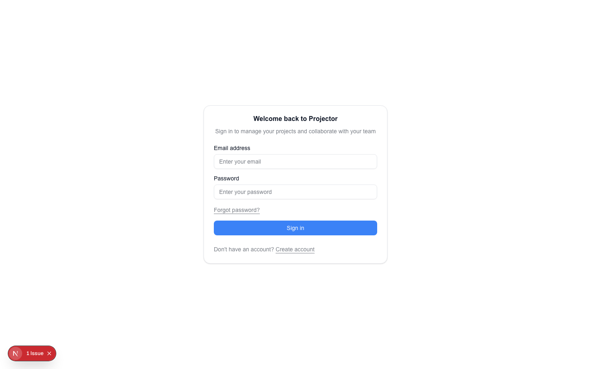

---

## Step 6: Inspect the Design System

Every component Coherent generates is backed by a real token system — not random colors. Visit `/design-system` in the preview to see it live.

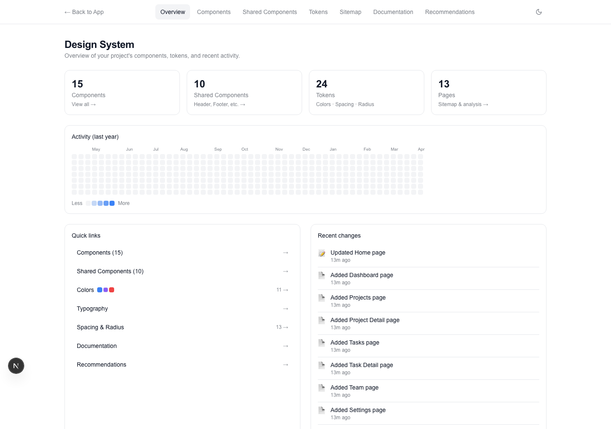

This page updates in real time. Change a token, regenerate a component — the viewer reflects it immediately.

---

## Step 7: Iterate — refine any page, any section

Here's where Coherent separates from one-shot AI tools. You can steer the design with follow-up prompts — globally or on a specific page.

**Refine the landing page:**

```bash
coherent chat "Refine the landing page: make the hero section more dramatic with a dark gradient background, large white headline, and a glowing CTA button. Add a customer logos bar below the hero (use names like Acme, Contour, Meridian, Helix, Vertex). Make the pricing cards equal height with a subtle ring highlight on the recommended plan."
```

**Edit a single page with the `--page` flag:**

```bash
coherent chat --page "Dashboard" "Redesign the activity feed as a timeline with timestamps, user avatars, and action descriptions. Make stat cards show trend indicators (up/down arrows with green/red tint)."
```

The `--page` flag scopes changes to that one page. Nothing else moves.

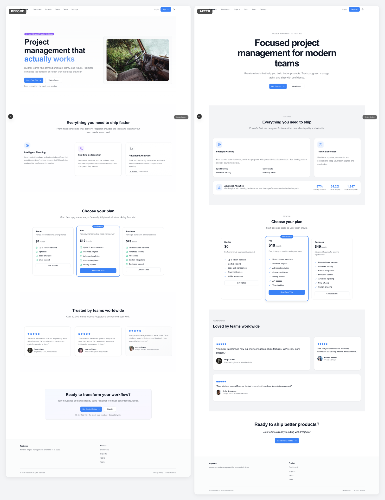

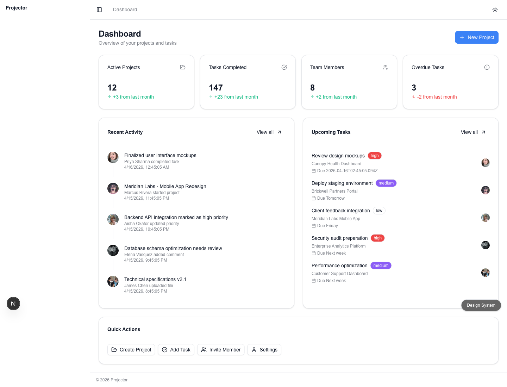

**Change the visual system itself — tokens, not just pages:**

Iteration isn't limited to page layouts. You can rewrite the design foundation — primary color, border radius, font — and every page re-renders with the new choices instantly. Because everything is token-driven, there are no hunt-and-replace edits.

```bash
# Swap the primary color across the entire app
coherent chat "Change the primary color from blue to emerald green."

# Change card corners from rounded to square
coherent chat "Make all card corners square (rounded-none) and buttons rounded-md."

# Swap the font family
coherent chat "Use Geist Sans as the primary font and JetBrains Mono for code."

# Shift the whole app towards a warmer palette
coherent chat "Tint the neutrals warm — swap bg-muted from cool gray to a warm stone tone."
```

Each of these mutates `design-system.config.ts` and `globals.css`, and every page that uses semantic tokens inherits the change. Buttons change color. Cards change radius. Fonts swap globally. No page-level edits needed.

> **Why this works and single-file AI tools don't:** Coherent separates the design system (tokens + shared components) from the pages that consume it. When the system changes, consumers update automatically. In tools that generate one HTML file per prompt, there's nothing to cascade into — every change is a rewrite.

---

## Step 8: The killer feature — shared components

When Coherent generated the app, it didn't just write 14 pages of code. It identified which UI patterns appear across multiple pages, extracted them into shared components, and registered each one with a unique ID.

```bash
coherent components list
```

```
📦 Shared Components

   CID-001  Header         layout      Landing layout
   CID-002  Footer         layout      Landing layout
   CID-003  StatCard       widget      Dashboard
   CID-004  ProjectCard    section     Dashboard, Projects
   CID-005  TaskItem       section     Dashboard, Tasks
   CID-006  MemberCard     section     Team
   CID-007  FilterBar      form        Projects, Tasks, Team
   CID-008  ActivityFeed   section     Dashboard
   CID-009  AppSidebar     navigation  All app pages
   CID-010  ThemeToggle    widget      App layout
```

**Edit a component once — it updates everywhere it's used.** No hunting through 14 files for duplicates. No inconsistencies between pages.

```bash
coherent chat --component "StatCard" "Add a sparkline trend indicator below the metric value"
```

Every page that uses StatCard — Dashboard, Project Detail — gets the update.

---

## Step 9: Quality check — 100+ design rules

```bash
coherent check
```

Coherent scans every page against 100+ design rules:

- **Semantic colors only** — raw Tailwind colors (`bg-gray-100`, `text-blue-500`) are flagged as errors
- **Accessibility** — missing alt text, inputs without labels, focus states, heading order, keyboard-inaccessible click targets
- **Typography scale** — enforced `text-sm` as body text, hierarchy through weight not size
- **Component compliance** — no raw `<button>`, `<input>`, `<select>` — shadcn/ui components only
- **Web quality** — `<Image>` instead of ``, metadata exports on marketing pages, CLS-safe image dimensions
- **Anti-slop** — no purple-to-blue gradients, no glassmorphism defaults, no "John Doe" placeholder names
- **Link integrity** — every `<Link>` has `href`, internal links point to existing routes

```
📄 Pages (14 scanned)
  ✔ 7 clean pages
  ⚠ 7 with warnings

🔗 Shared Components (10 checked)
  ✔ All healthy

7 clean pages | 7 with warnings | 10 healthy shared
```

Fix issues automatically:

```bash
coherent fix
```

TypeScript errors, missing components, raw color values, layout inconsistencies — resolved in one command.

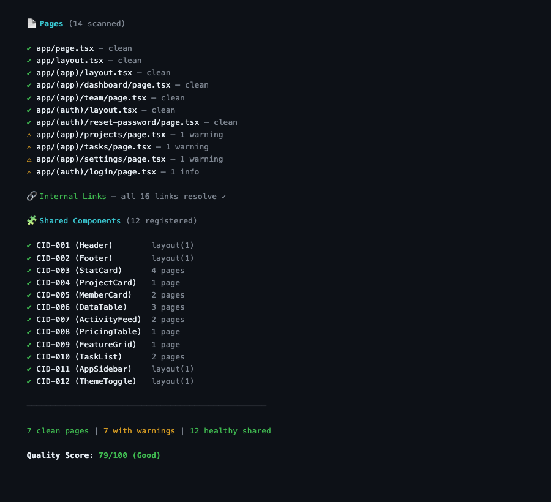

---

## Step 10: Export

```bash
coherent export --output ./projector-export
```

The export strips Coherent dev tooling (Design System Viewer, overlay) and produces a clean Next.js project. From here, a developer can:

- Wire up a backend (Supabase, Firebase, your own API)
- Add real authentication (NextAuth, Clerk)
- Deploy to Vercel, Netlify, Fly.io, Railway — it's a standard Next.js 15 app

```bash
cd projector-export
npx vercel
```

---

## What you just built

31 minutes. One prompt to generate. A few prompts to refine.

The result:
- **12 pages** — landing, dashboard, projects, tasks, team, settings, 4 auth flows, 2 detail routes
- **10 shared components** — automatically extracted, registered with IDs, reusable
- **Dark and light mode** — design tokens cascade, both work out of the box
- **100+ design rules** — enforced during generation, not bolted on after
- **Clickable, navigable prototype** — real Next.js, not a static mockup

No CSS written by hand. No Figma file. No design system manual. No developer-designer handoff meeting.

The workflow:

**Describe → Preview → Iterate → Check → Export.**

---

## FAQ

**Q: Is this a full working app?**
No. Coherent generates an interactive UI prototype — the visual design, page layouts, navigation, components, design tokens, light/dark mode. It uses sample data, not a real backend. Think of it as the output of a design sprint, but in code instead of Figma. A developer can take the exported Next.js project and wire up real data, auth, and business logic.

**Q: How much does it cost?**
Generating a full app like Projector costs $0.50–$2 in AI API credits (Claude or OpenAI). Coherent itself is free to install. The only cost is the AI API calls during generation.

**Q: Can I edit the generated code directly?**
Yes. It's standard Next.js + Tailwind CSS + shadcn/ui. Open any file in VS Code, Cursor, or any editor. Coherent doesn't lock you in — the exported code has zero proprietary dependencies.

**Q: Can I use it with Cursor?**
Yes. Coherent generates `.cursorrules` with your design system context, so Cursor's AI autocomplete respects your tokens and components. Run `coherent rules` to regenerate after changes.

**Q: What if I want a completely different style?**
Describe the mood in your prompt. "Minimal and editorial" produces a fundamentally different result than "bold and playful." Coherent's design thinking layer translates atmosphere language ("dark and focused," "airy and warm") into concrete design decisions before the first component is generated.

**Q: What AI models does it support?**
Claude Sonnet 4 (default) or GPT-4o. Set via environment variable or `--provider` flag.

---

*Built with [Coherent Design Method](https://getcoherent.design). Install with `npm install -g @getcoherent/cli`.*
