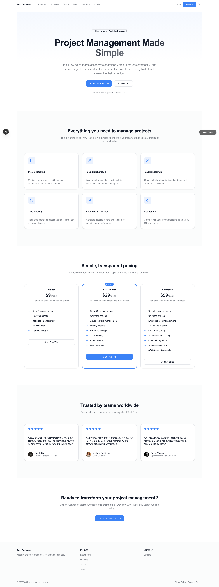
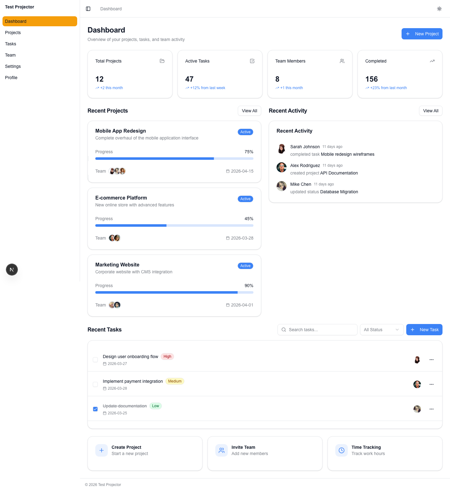
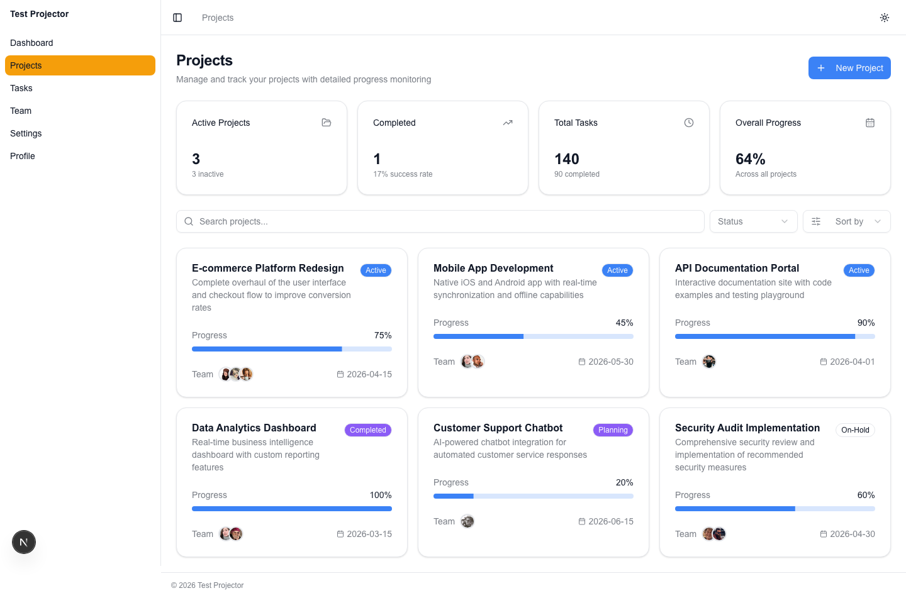
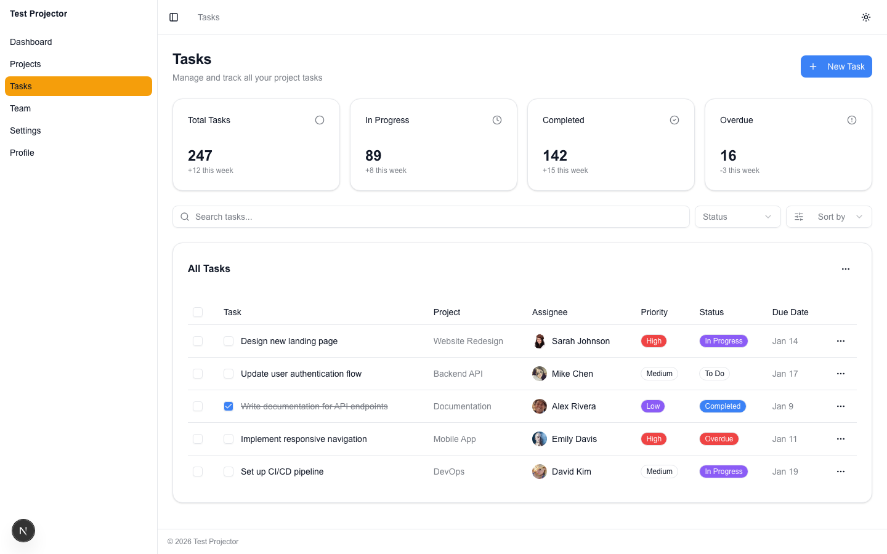
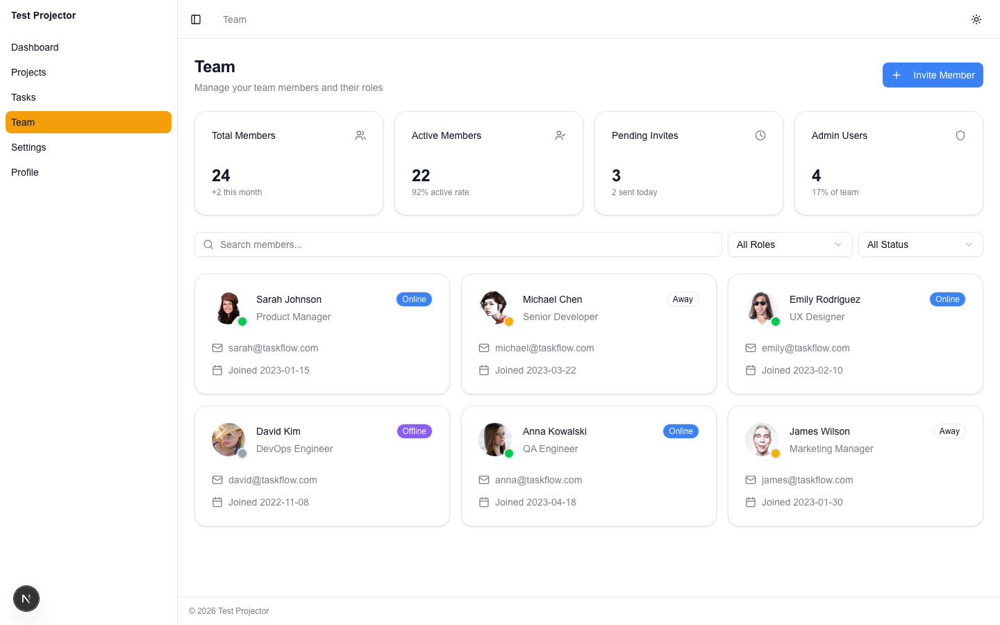
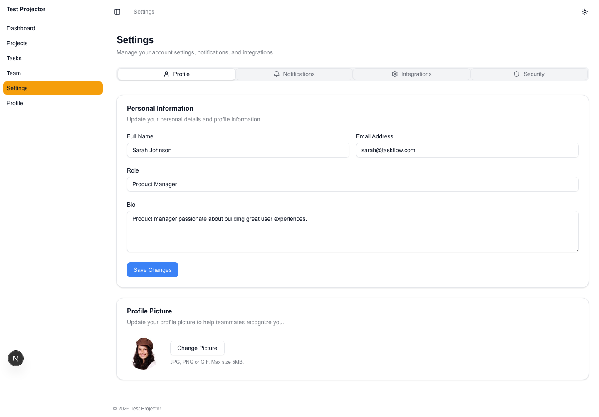
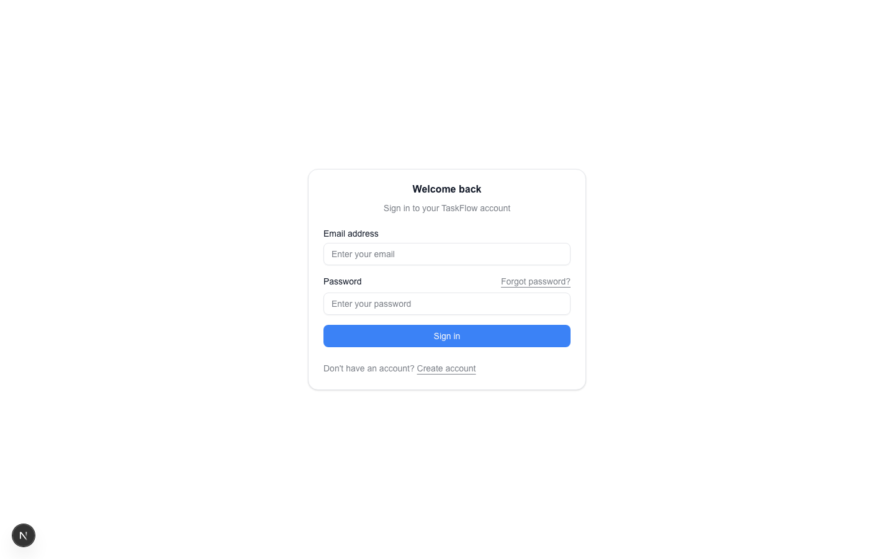
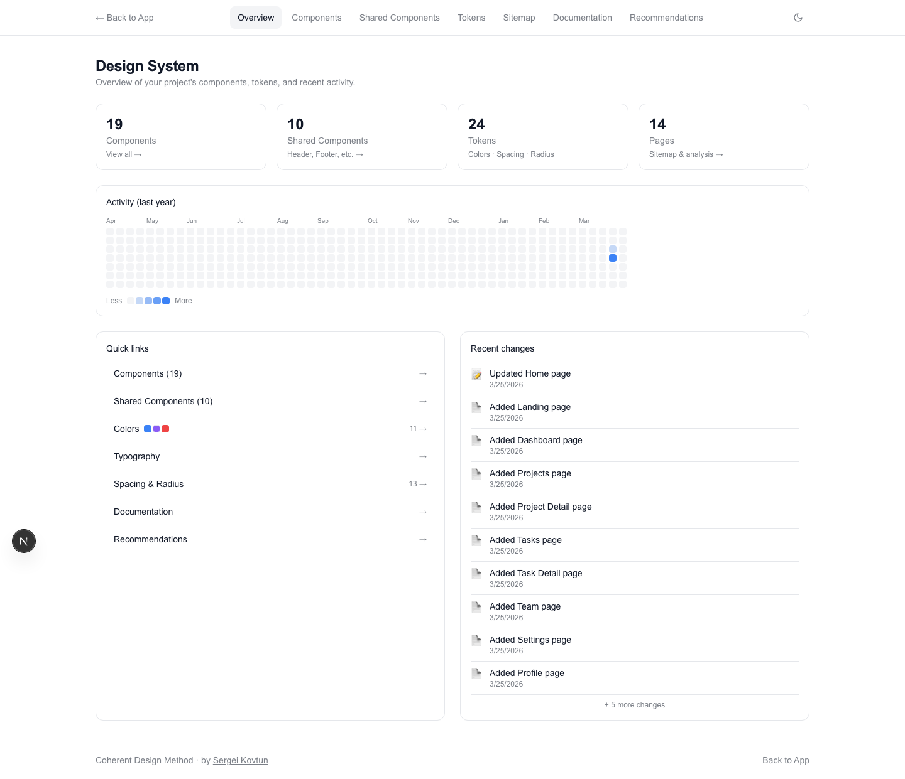

# From Idea to Production: Building a SaaS App with Coherent Design Method

> A step-by-step guide to creating a complete project management app — without writing a single line of code.

In this tutorial, we'll build **Projector** — a full-featured SaaS project management application — using only natural language prompts. You'll see how to generate pages, create reusable components, iterate on design, check quality, and export a production-ready app.

**What you'll need:**
- Node.js 18+
- An Anthropic API key (Claude)
- ~30 minutes

**What you'll build:**
- Landing page with hero, features, and pricing
- Dashboard with sidebar navigation
- Projects, Tasks, Team, and Settings pages
- Detail pages (Project Detail, Task Detail) — auto-inferred
- Auth pages (Login, Register, Forgot Password, Reset Password)
- 10 auto-generated shared components (StatCard, ProjectCard, TaskItem, etc.)
- A polished design with consistent tokens across light and dark mode

Let's get started.

---

## Step 1: Create the project

Every Coherent project starts with `init`. This sets up a Next.js 15 app with Tailwind CSS, shadcn/ui components, design tokens, and a Design System Viewer — all pre-configured and ready for AI-driven design.

```
coherent init projector
```

**What just happened:**
- Next.js 15 project with Tailwind CSS and shadcn/ui
- Design System Viewer at `/design-system`
- Default landing page with placeholder content
- Design tokens in `globals.css`
- AI context files (`.cursorrules`, `CLAUDE.md`) for editor integration

Auth pages are auto-generated during `coherent chat` — no need to scaffold them separately.

**Cost:** $0 (no AI calls)
**Time:** ~30 seconds

---

## Step 2: Preview the starting point

Before making any changes, let's see what we have out of the box.

```
coherent preview
```

This starts the Next.js dev server and opens the app in your browser. You'll see a default landing page and can navigate to `/design-system` to explore the Design System Viewer.

**Things to notice:**
- The default landing page with placeholder content
- Theme toggle (sun/moon icon) — try switching between light and dark mode
- Design System Viewer at `/design-system` — this will update as we build

---

## Step 3: Generate the full app

This is where the magic happens. One prompt describes the entire application — pages, navigation, content structure — and Coherent generates everything.

```
coherent chat "Create a SaaS project management app called Projector. Use sidebar navigation for the app pages. Pages: landing page with hero section, features grid, pricing cards, and testimonials; dashboard showing project stats, recent activity feed, and task overview cards; projects page with project cards showing progress bars and team avatars; tasks page with task table, filters, and status badges; team page with member cards and roles; settings page with profile, notifications and integrations tabs"
```

**Prompt tips:**
- **Name your app** — say "called Projector" so Coherent uses it in headers, footers, and metadata. If you forget, you can rename later with `coherent chat "rename the app to Projector"`.
- **State the navigation type** — say "Use SIDEBAR navigation" explicitly. Without this, Coherent defaults to header navigation.
- **Don't worry about auth pages** — Coherent auto-infers and generates `/login`, `/register`, `/forgot-password`, and `/reset-password` from cross-page links, placing them in a centered auth layout.
- **Don't worry about detail pages** — routes like `/projects/[id]` or `/tasks/[id]` are auto-inferred from list pages.

Behind the scenes, Coherent uses a 6-phase pipeline:

1. **Phase 1 — Plan Pages** — AI analyzes your prompt and determines which pages to create, including auto-inferred detail pages (e.g., `/projects/[id]`, `/tasks/[id]`) and auth pages (`/login`, `/register`, `/forgot-password`, `/reset-password`)
2. **Phase 2 — Architecture Plan** — AI creates a Component Architecture Plan: groups pages by navigation context (public/app/auth), identifies reusable UI components that appear on 2+ pages, and assigns page types (marketing, app, auth)
3. **Phase 3 — Generate Home** — Creates the landing page first, establishing visual style
4. **Phase 4 — Extract Style** — Pulls design patterns from the home page for consistency
5. **Phase 4.5 — Generate Shared Components** — Creates reusable components identified in the architecture plan (e.g., StatCard, ProjectCard, FilterBar)
6. **Phase 5 — Generate All Pages** — Creates remaining pages using the shared components and extracted style

Before applying changes, a **pre-flight check** auto-installs any missing shadcn/ui components (Badge, Tabs, Select, etc.). After each page is written, an **inline quality check** validates against design rules and auto-fixes errors when possible.

This ensures every page shares the same visual language — consistent colors, typography, spacing, and component style — with reusable components used across pages from the start.

> **Tip:** Occasionally a page may come back without content (especially with 14+ pages in one request). If you see a warning like _"Page X has no generated code"_, regenerate it individually:
>
> ```
> coherent chat "regenerate the Profile page with full content"
> ```

---

## Step 4: Review the result

Let's see what was generated. First, check the project status:

```
coherent status
```

This shows a summary: how many pages, shared components, and design tokens exist in the project.

```
📊 Statistics:

   Pages: 14
   Components: 19
   Design tokens: 52
```

Now preview the app:

```
coherent preview
```

Walk through every page to see the results. With the architecture plan, pages are organized into route groups:
- **Public** (`/`) — header navigation, marketing layout
- **App** (`/dashboard`, `/projects`, `/tasks`, `/team`, `/settings`) — sidebar navigation, data-dense layout
- **Auth** (`/login`, `/register`, `/forgot-password`, `/reset-password`) — centered card, no navigation



The landing page includes a hero section with CTA, a features grid, pricing cards with a highlighted recommended plan, testimonials, and a footer — all generated from a single prompt.



The dashboard shows stat cards (Total Projects, Active Tasks, Team Members, Completed), recent projects with progress bars, an activity feed, and a recent tasks table. The sidebar provides navigation to all app pages.



Each project card shows a title, description, progress bar, team member avatars, status badge, and due date. The page includes stat cards at the top and a filter bar for searching and sorting.



The tasks page uses a data table with columns for task name, project, assignee, priority, status, and due date. Stat cards at the top provide a quick summary. The filter bar supports search, status, and sort.



Team member cards display name, role, email, join date, and an avatar. The page includes stat cards and filtering by role and status.



Settings uses a tabbed layout (Profile, Notifications, Integrations, Security) with form fields for each section.



Auth pages use a centered card layout with no navigation — clean and focused on the task at hand. Login, Register, Forgot Password, and Reset Password pages are auto-generated.



The Design System Viewer at `/design-system` tracks all 19 components, 10 shared components, 24 color tokens, and 14 spacing/radius values. It updates automatically as you add pages and components.

---

## Step 5: Refine the design

The generated app looks good, but we want to make it our own. Let's change the color scheme and improve the landing page hero.

```
coherent chat "Change the color scheme to indigo primary, make the landing page hero more impactful with gradient background"
```

Design tokens cascade across all pages automatically. When you change the primary color from the default to indigo, every button, link, accent, and highlighted element updates — across every page, in both light and dark mode.

---

## Step 6: Edit a specific page

Sometimes you want to refine just one page without touching the rest. The `--page` flag gives you precision control.

Let's redesign the pricing section:

```
coherent chat --page "Landing" "Redesign the pricing section: 3 tiers (Starter, Pro, Enterprise) as cards with a highlighted recommended plan, monthly/yearly toggle, feature comparison list below"
```

**Why `--page`?** Without the flag, Coherent might interpret your prompt as a request affecting multiple pages. The `--page` flag scopes the change to exactly the page you specify.

---

## Step 7: See what you have

As your project grows, it's helpful to see what components exist. The `components list` command gives you an inventory:

```
coherent components list
```

You'll see shared components created during generation, plus all UI components from shadcn/ui. Each shared component has a unique ID (CID-001, CID-002, etc.) tracked in the component registry.

In the Projector app, Coherent generated 10 shared components:

| ID | Component | Type | Used on |
|----|-----------|------|---------|
| CID-001 | Header | layout | Public layout |
| CID-002 | Footer | layout | Public layout |
| CID-003 | StatCard | widget | Dashboard, Project Detail |
| CID-004 | ProjectCard | section | Projects, Dashboard |
| CID-005 | TaskItem | section | Tasks, Dashboard |
| CID-006 | MemberCard | section | Team |
| CID-007 | FilterBar | form | Projects, Tasks, Team |
| CID-008 | ActivityFeed | section | Dashboard |
| CID-009 | AppSidebar | navigation | App layout |
| CID-010 | ThemeToggle | widget | App layout |

---

## Step 8: Create a reusable component

Coherent already generated shared components during Phase 4.5, but you can also create new ones manually. Let's create a **StatsPanel** — a custom row of metric cards with trend indicators.

```
coherent chat --component "StatsPanel" "Create a shared StatsPanel component — a horizontal row of 4 stat cards. Each card has: an icon in a rounded colored background, a large metric number, a label below, and a trend indicator (up/down arrow with percentage in green or red). Use Card from shadcn, semantic tokens for colors"
```

This creates a new shared component and registers it in the component system. The component uses design tokens for colors, so it automatically adapts to light/dark mode and respects the color scheme.

---

## Step 9: Use the component across pages

Now we'll place StatsPanel on three different pages, each with contextually relevant data:

```
coherent chat "Update the dashboard page to use StatsPanel at the top showing: Total Projects, Active Tasks, Team Members, Completed This Week. Also add StatsPanel to the projects page showing: Total Projects, In Progress, Completed, Overdue. And to settings page showing: Storage Used, API Calls, Team Size, Active Integrations"
```

One prompt, three pages updated. The StatsPanel component stays consistent — same layout, same visual treatment — but the data and icons are different on each page.

---

## Step 10: Modify the component — updates everywhere

This is the real power of shared components. When you change StatsPanel, it updates on all three pages simultaneously.

```
coherent chat --component "StatsPanel" "Redesign StatsPanel: add a sparkline mini chart to each card, make the trend percentage bolder, add a subtle hover effect with shadow elevation"
```

One edit, three pages updated. No copy-pasting, no hunting for duplicates, no inconsistencies.

---

## Step 11: Undo and try again

Design is iterative. Sometimes an idea doesn't work out — and that's fine. Coherent keeps a backup of your project before every change.

The sparklines looked too busy? Let's undo:

```
coherent undo
```

This restores the project to the state before the last `coherent chat` command. Now let's try a different design direction:

```
coherent chat --component "StatsPanel" "Make the StatsPanel cards more compact with smaller icons, add a thin colored left border matching the icon color, keep the trend indicator but remove the percentage — just show the arrow"
```

The undo/iterate cycle is how real design works. Try something, evaluate, revert if needed, try something different. No code to manage, no git conflicts — just creative exploration.

---

## Step 12: Edit a layout component

Layout components like the Header appear on every page. Editing them is just as easy — and the change is reflected site-wide.

```
coherent chat --component "Header" "Add a notification bell icon with a red dot badge and user avatar dropdown to the header"
```

The change applies to every public page that uses the Header. Similarly, editing AppSidebar updates the sidebar across all app pages.

---

## Step 13: Check quality

Coherent already runs inline quality checks during generation, auto-fixing common issues (HTML entities, missing `"use client"`, border cleanup, icon validation). But before exporting, let's run the full quality checker. It validates your entire project against 97 design rules covering:

- **Color consistency** — no hardcoded Tailwind colors (like `bg-blue-500`), only semantic tokens
- **Accessibility** — heading hierarchy, alt text, focus indicators
- **Typography** — consistent font sizes and weights
- **Layout** — proper spacing, no broken internal links

```
coherent check
```

```
📄 Pages (19 scanned)

  ✔ app/(app)/layout.tsx — clean
  ✔ app/(app)/profile/page.tsx — clean
  ✔ app/(auth)/forgot-password/page.tsx — clean
  ✔ app/(auth)/reset-password/page.tsx — clean
  ✔ app/layout.tsx — clean
  ⚠ app/(app)/dashboard/page.tsx — 1 warning(s)
  ⚠ app/(app)/settings/page.tsx — 1 warning(s)
  ...

  🔗 Internal Links — all 18 links resolve ✓

  🧩 Shared Components (10 registered)
  ✔ CID-001 (Header) — layout(1) + 0 page(s)
  ✔ CID-003 (StatCard) — 1 page(s)
  ✔ CID-004 (ProjectCard) — 2 page(s)
  ...

  7 clean pages | 7 with warnings | 10 healthy shared
```

All internal links resolve. All shared components are properly registered and used. Warnings point to potential improvements like missing empty states or confirmation dialogs on destructive actions.

---

## Step 14: Auto-fix issues

`coherent fix` is a unified self-healing command. It handles everything from TypeScript errors to raw colors — in one run.

```
coherent fix
```

What it does:
- **TypeScript auto-fix** — deterministic fixers handle field name mismatches (e.g., `time` → `timestamp`), union type casing (`'Active'` → `'active'`), and missing event handler props. When an API key is configured, AI fixes remaining errors automatically.
- **Missing components** — auto-installs any referenced shadcn/ui components
- **CSS sync** — adds missing design token variables to `globals.css`
- **Raw colors** — replaces hardcoded Tailwind colors with semantic tokens
- **Layout structure** — verifies route group layouts (public/app/auth)

Run `coherent check` again to confirm everything is clean:

```
coherent check
```

---

## Step 15: Export for deployment

Your app is ready. Export it as a clean Next.js project — stripped of all Coherent development artifacts (Design System Viewer, config files, dev tools) — ready for deployment to Vercel, Netlify, or any Node.js host.

```
coherent export --output ./projector-export
```

The exported app is a standard Next.js project. Deploy it however you normally would:

```
cd projector-export
npx vercel
```

---

## What we built

In ~30 minutes and a handful of prompts, we created a complete SaaS application with:

- **14 pages** — Landing, Dashboard, Projects, Project Detail, Tasks, Task Detail, Team, Profile, Settings, Login, Register, Forgot Password, Reset Password, and Home
- **Sidebar navigation** — set explicitly in the prompt ("Use sidebar navigation")
- **Route groups** — public (header nav), app (sidebar), auth (no nav, centered card)
- **10 shared components** — StatCard, ProjectCard, TaskItem, MemberCard, FilterBar, ActivityFeed, Header, Footer, AppSidebar, ThemeToggle
- **Design tokens** — consistent colors across light and dark mode
- **Auth flow** — Login, Register, Forgot Password, Reset Password with centered card layout
- **Inline quality checks** — errors auto-fixed during generation
- **Production export** — clean Next.js app, ready to deploy

### The workflow

1. **Describe** what you want in natural language
2. **Preview** the result instantly
3. **Iterate** — change colors, add pages, create components
4. **Reuse** — shared components update everywhere
5. **Undo** — try different approaches risk-free
6. **Check** — validate quality automatically
7. **Export** — deploy to production

No CSS written. No component libraries researched. No design-to-code handoff. Just ideas into a working app.

---

*Built with [Coherent Design Method](https://getcoherent.dev). Install with `npm install -g @getcoherent/cli`.*
